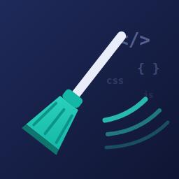

# Asset Sweep – Remove Unused CSS & JS


**Asset Sweep** removes unused CSS and JavaScript from your web projects — making your site faster, your bundle smaller, and your page load lighter.



## Why Asset Sweep?

Modern web tooling leaves a lot on the table. WordPress emoji styles, unused Gutenberg CSS, jQuery Migrate, dashicons for logged-out users—these are killers for performance. Asset Sweep finds and removes them, one toggle at a time, safely.

**Perfect for:**
- Elementor, Divi, and other page-builder sites
- WordPress sites bloated with unused scripts and styles
- Any web project where every kilobyte counts

## Installation

### WordPress Plugin

Asset Sweep is available as a WordPress plugin on [wordpress.org](https://wordpress.org/plugins/asset-sweep/).

**Quick Install:**
1. Go to **Plugins → Add New** in WordPress admin
2. Search for "Asset Sweep"
3. Click **Install Now** and then **Activate**
4. Go to **Settings → Asset Sweep** to configure

[View Plugin Source →](./wordpress-plugin/)

### Standalone CLI Tool

#### Via npm (recommended)
```bash
npm install -g asset-sweep
```

#### Via Yarn
```bash
yarn global add asset-sweep
```

#### From source
```bash
git clone https://github.com/SteveKinzey/Asset-Sweep-Remove-Unused-CSS-JS.git
cd Asset-Sweep-Remove-Unused-CSS-JS
npm install
npm run build
npm link
```

## What It Removes

Asset Sweep gives you toggles for one optimization each:

✂️ **WordPress Emoji** — Removes the `wp-emoji-release.min.js` and associated styles

✂️ **Embeds** — Removes `wp-embed.min.js` and oEmbed discovery links

✂️ **Gutenberg Block CSS** — Strips Gutenberg's block-library styles (safe for Elementor, Divi, etc.)

✂️ **Global Styles** — Removes `theme.json` global styles

✂️ **jQuery Migrate** — Removes the jQuery Migrate compatibility shim

✂️ **Dashicons** — Removes dashicons CSS for logged-out visitors

✂️ **Custom Handles** — Remove any enqueued script or style by handle (site-wide)

## Debug Mode

Enable **Debug Mode** to see every enqueued script and style. Visit your front end while logged in as admin, then **View Source**—you'll see a comment at the bottom listing every handle, perfect for finding custom handles to remove.

```html
<!-- Asset Sweep Debug Mode
Enqueued Scripts:
- wp-emoji-release
- wp-embed
- jquery
- jquery-migrate
- (your custom handles here)

Enqueued Styles:
- wp-emoji-styles
- dashicons
- (your custom styles here)
-->
```

## Safety First

- **All optimizations are off by default** — you choose what to enable
- **Enable one at a time** — check your site after each change
- **Easy rollback** — disable any option instantly
- **Database-safe** — stores only one small settings option, nothing destructive
- **Admin-safe** — front end only; WordPress admin is never touched

## Performance Impact

Real-world savings on a typical Elementor site:

| Asset | Size | Type |
|-------|------|------|
| Emoji + styles | 14 KB | Script + CSS |
| Embed script + links | 3 KB | Script |
| Block CSS | 22 KB | CSS |
| jQuery Migrate | 9 KB | Script |
| Dashicons | 40 KB | CSS |
| **Total** | **88 KB** | **Uncompressed** |

On a compressed, cached site with good hosting, these savings translate to ~20–50ms faster page load times and meaningfully lower CLS and FCP metrics.

## Configuration (WordPress)

Go to **Settings → Asset Sweep** to toggle each optimization:

1. **Remove WordPress Emoji** — Off by default
2. **Remove Embeds** — Off by default
3. **Remove Block Library CSS** — Off by default
4. **Remove Global Styles** — Off by default
5. **Remove jQuery Migrate** — Off by default
6. **Remove Dashicons (front-end only)** — Off by default
7. **Debug Mode** — Off by default
8. **Custom Styles to Remove** — Comma-separated list of style handles
9. **Custom Scripts to Remove** — Comma-separated list of script handles

## CLI Usage

```bash
asset-sweep analyze ./src
```

Scans your project for unused CSS and JavaScript.

```bash
asset-sweep --help
```

Full CLI documentation.

## CI/CD Integration

### GitHub Actions

```yaml
name: Asset Sweep
on: [push, pull_request]

jobs:
  sweep:
    runs-on: ubuntu-latest
    steps:
      - uses: actions/checkout@v3
      - uses: actions/setup-node@v3
        with:
          node-version: 18
      - run: npm install -g asset-sweep
      - run: asset-sweep analyze ./src
```

### GitLab CI

```yaml
asset_sweep:
  image: node:18
  script:
    - npm install -g asset-sweep
    - asset-sweep analyze ./src
```

## Contributing

We welcome contributions! See [CONTRIBUTING.md](./CONTRIBUTING.md) for guidelines on development, testing, and pull requests.

## License

Asset Sweep is licensed under the MIT License. See [LICENSE](./LICENSE) for details.

## Roadmap

- [ ] Visual bundle analyzer (what size am I actually removing?)
- [ ] Per-page dequeue rules (remove emoji only on homepages)
- [ ] Preload/prefetch optimization suggestions
- [ ] Performance audit integration (Web Vitals reporting)
- [ ] Multisite support with network settings

## FAQ

**Q: Will this break my site?**

A: Each optimization is off by default. Enable one, check your site, move on. If something breaks, disable it—there's no risk.

**Q: Is this safe for Elementor?**

A: Yes. Elementor doesn't use Gutenberg block CSS, so removing it is typically safe. Test with your theme first.

**Q: Can I remove handles I don't recognize?**

A: Use Debug Mode to see what's enqueued. Remove only what you're certain about. Most of the built-in removals are battle-tested.

**Q: Does this modify my theme or plugins?**

A: No. It stores one small settings option in `wp_options`. Uninstall and everything reverts.

---

**Made by [Steve Kinzey](https://octoolhouse.com) at [SK America](https://sk-america.com)**
