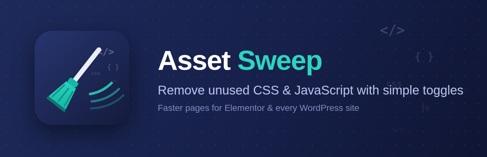

# Asset Sweep – Remove Unused CSS & JS



**Asset Sweep** removes unused CSS and JavaScript from your web projects — making your site faster, your bundle smaller, and your visitors happier.

## 🚀 WordPress Plugin

The easiest way to optimize your WordPress site. **[Download Now](https://github.com/SteveKinzey/Asset-Sweep-Remove-Unused-CSS-JS/releases)** or [Read Plugin Guide](./WORDPRESS-PLUGIN.md).

### Quick Start

1. Download `asset-sweep.zip`
2. Upload via Plugins → Add New → Upload Plugin
3. Activate and go to Settings → Asset Sweep
4. Enable optimizations one at a time

### What It Removes

- WordPress emoji script and styles (14 KB)
- Embeds and oEmbed discovery (3 KB)
- Gutenberg block library CSS (22 KB)
- Global theme.json styles
- jQuery Migrate (9 KB)
- Dashicons for logged-out users (40 KB)
- Any custom script or style handles

**Total savings: 88 KB+ per page** = 20–50ms faster load times.

### Features

✅ **One Toggle Per Optimization** — Control exactly what gets removed  
✅ **Debug Mode** — See all enqueued assets  
✅ **Safe & Reversible** — Disable instantly, reverts on uninstall  
✅ **Elementor Friendly** — Built for page-builder sites  
✅ **Admin-Safe** — Front end only, never touches WordPress admin  

### Requirements

- WordPress 5.8+
- PHP 7.2+
- License: GPL v2 or later

---

## 💻 CLI Tool

For developers and agencies working on multiple projects.

```bash
npm install -g asset-sweep
asset-sweep analyze ./src
```

See [full documentation](./CONTRIBUTING.md) and [changelog](./CHANGELOG.md).

---

## 📚 Documentation

- **[WordPress Plugin Guide](./WORDPRESS-PLUGIN.md)** — How to use the plugin
- **[About Asset Sweep](./ABOUT.md)** — Philosophy and approach
- **[Contributing](./CONTRIBUTING.md)** — Developer setup and guidelines
- **[Changelog](./CHANGELOG.md)** — Version history

## 📋 License

Asset Sweep is licensed under the MIT License. See [LICENSE](./LICENSE) for details.

---

**[⬇️ Download Plugin](https://github.com/SteveKinzey/Asset-Sweep-Remove-Unused-CSS-JS/releases)** | **[Report Issues](https://github.com/SteveKinzey/Asset-Sweep-Remove-Unused-CSS-JS/issues)** | **[Discussions](https://github.com/SteveKinzey/Asset-Sweep-Remove-Unused-CSS-JS/discussions)**

Made by [Steve Kinzey](https://octoolhouse.com)
